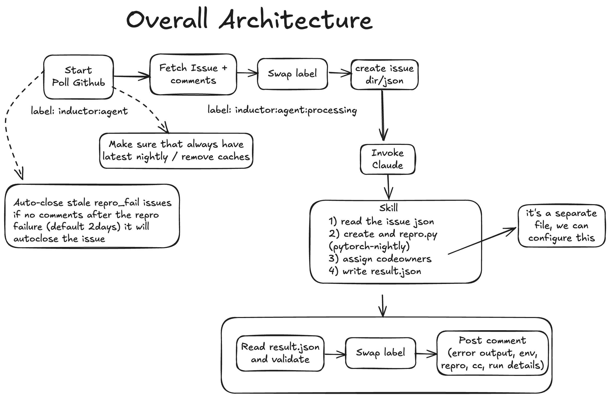
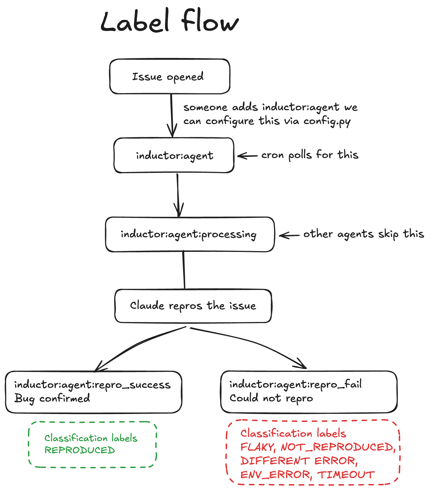

# inductor-agent

Automated reproduction of PyTorch Inductor GitHub issues using Claude Code.

## Problem

When a PyTorch Inductor issue is filed, the engineer has to read and find code snippets, set up an environment, piece together a runnable repro script, run it multiple times to check for flakiness, and report back, all of which can be automated. This agent does exactly that, reducing a manual process, so the engineer can skip straight to debugging or trigger the debug agent.


## How it works

A cron job polls GitHub for `inductor:agent` labeled issues, fetches the issue body, hands it to Claude Code (headless, sandboxed, no network) which writes a repro script and runs it 3 times against `pytorch-nightly`, then updates the label and posts a structured comment with the results.

## Architecture



## Label flow



## Classification outcomes

| Classification | Meaning | Label | Action |
|---|---|---|---|
| `REPRODUCED` | All 3 runs fail with the reported error | `repro_success` | Tag code owners, run bisection |
| `FLAKY` | Some runs fail, some pass | `repro_success` | Tag code owners, run bisection |
| `NOT_REPRODUCED` | All 3 runs pass | `repro_fail` | Auto-close after 2 days if no response |
| `DIFFERENT_ERROR` | Fails with a different error | `repro_fail` | On-call investigates (**not** auto-closed) |
| `ENV_ERROR` | Env broken or Claude failed | `repro_fail` | Check logs (**not** auto-closed) |
| `TIMEOUT` | Claude exceeded time limit | `repro_fail` | Check logs (**not** auto-closed) |
| `PREDEFINED_MITIGATION` | Standard mitigation applies (e.g. numerical tolerance) | `repro_fail` | Auto-close eligible |
| `SYNTHESIZED_REPRO` | Repro synthesized from description (no code in issue) | `repro_success` | Tag code owners, note synthesized |

## New features

### 1. Repro synthesis (no clean code provided)

When an issue doesn't contain a clean reproduction script, the agent attempts to **synthesize** one from descriptions, error messages, and code fragments mentioned in the issue. The synthesized script is tagged in the GitHub comment so reviewers know it was auto-generated.

### 2. Nightly bisection

When a bug is reproduced, the agent runs a **binary-search bisection** across older nightly builds to identify when the regression was introduced. Results include:

- **Confidence level** (high/medium/low)
- A table of tested nightly versions with pass/fail status
- If the bug reproduces on ALL tested nightlies, it's flagged as a **long-standing issue** (not a recent regression)

```
Bisect: current nightly → FAIL
Bisect: 2 days ago      → FAIL
Bisect: 7 days ago      → PASS
→ Regression window: 7 days ago → 2 days ago
```

### 3. Conservative auto-close

Auto-close **only** applies to proper non-repro cases:
- `NOT_REPRODUCED` — the bug doesn't reproduce
- `PREDEFINED_MITIGATION` — standard mitigation confirmed

The following are **never** auto-closed (they may indicate infra issues):
- `DIFFERENT_ERROR`
- `ENV_ERROR`
- `TIMEOUT`

### 4. Broader dependency sets (external libraries)

The agent detects when an issue requires third-party external libraries and installs them automatically:

| Library Group | Packages |
|---|---|
| **transformers** | transformers, accelerate, datasets |
| **diffusers** | diffusers, transformers, accelerate |
| **timm** | timm |
| **huggingface_hub** | huggingface_hub, safetensors |
| **sentence_transformers** | sentence-transformers |
| **lightning** | lightning, pytorch-lightning |

Detection is based on import markers in the issue body and repro script.

### 5. Predefined checks for common categories

Claude detects common issue categories by scanning keywords in the issue text
and generates the appropriate diagnostic scripts itself (via SKILL.md instructions).
No separate Python module is needed — Claude handles detection, script creation,
and execution end-to-end:

| Category | Detection Keywords | Auto-close? |
|---|---|---|
| **Numerical tolerance** | allclose, atol, rtol, accuracy, mismatch | ✅ Yes (if diff < 1e-6) |
| **Precision cast** | float16, bfloat16, mixed precision, autocast | ✅ Yes (if diff < 1e-6) |
| **Dynamic shapes** | guard, symbolic, SymInt, data-dependent | ❌ No (guidance only) |
| **Graph break** | graph break, Unsupported:, skipping | ❌ No (guidance only) |

Example: A user reports "torch.compile gives slightly different output" with max_diff=5.96e-08. The predefined numerical tolerance check confirms this is within expected floating-point reordering range and the issue is eligible for auto-close with an explanation.


## Code owner tagging

Claude reads `codeowners.py` and identifies which inductor subsystems are affected based on the traceback and error type. Owners are tagged in the comment.


## Nightly env management

```
main.py starts
    │
    ├── pytorch-nightly env missing?
    │       → conda create + pip install nightly
    │
    ├── torch version date > 24h old?
    │       → pip install --upgrade nightly
    │
    └── fresh?
            → do nothing, proceed
            → cache collect_env output (once)
```

The `collect_env` output is captured once at startup via:
```bash
curl -sL https://raw.githubusercontent.com/pytorch/pytorch/main/torch/utils/collect_env.py | $ENV/bin/python
```
Included in every comment under a collapsible `<details>` dropdown.

## Setup

### Prerequisites

```bash
gh auth status
conda --version
claude --version
```

### Run

```bash
cd inductor-agent

# Poll once
python main.py

# Poll continuously or use cron
python main.py --loop

# Single issue
python main.py --issue 1
```


## Configuration

All in `config.py`, overridable via env vars:

| Variable | Default | Description |
|---|---|---|
| `GITHUB_REPO` | `karthickai/test-inuductor-agent` | Repo to monitor |
| `POLL_INTERVAL_SECONDS` | `120` | Loop poll interval |
| `NIGHTLY_MAX_AGE_HOURS` | `72` | Auto-update nightly if older |
| `CLAUDE_TIMEOUT_SECONDS` | `2400` | Hard timeout for Claude |
| `WORKDIR_CLEANUP_DAYS` | `7` | Auto-delete old workdirs |
| `AUTO_CLOSE_AFTER_MINUTES` | `2880` | Auto-close NOT_REPRODUCED after 2 days |
| `AUTO_CLOSE_GRACE_MINUTES` | `1440` | Grace period before actual close |
| `GH_RETRY_ATTEMPTS` | `3` | Retry count for gh calls |
| `BISECT_ENABLED` | `1` | Enable nightly bisection |
| `BISECT_MAX_VERSIONS` | `7` | Max nightly versions to test during bisect |
| `BISECT_LOOKBACK_DAYS` | `14` | How far back to look for nightlies |
| `BISECT_TIMEOUT_SECONDS` | `300` | Timeout per bisect repro run |
| `EXTERNAL_INSTALL_TIMEOUT` | `300` | Timeout for external dep install |

## Project structure

```
inductor-agent/
├── main.py                 # Cron: poll → fetch → Claude → label → comment
├── config.py               # All configuration
├── codeowners.py           # Area-to-owner mapping (Claude reads this)
├── nightly_bisect.py       # Bisect across nightly builds to find regressions
├── external_deps.py        # Detect & install external libraries (HF, timm, etc.)
├── .claude/
│   ├── settings.local.json # Claude Code tool permissions
│   └── skills/
│       └── inductor-repro/
│           └── SKILL.md    # Claude skill: read issue → repro → result.json
├── workdir/
│   └── {issue_number}/
│       ├── issue.json             # Written by main.py
│       ├── repro.py               # Written by Claude (includes predefined checks if applicable)
│       ├── result.json            # Written by Claude, enriched by main.py
│       └── claude_output.log      # Claude's full output
├── logs/
│   └── main.log
└── README.md
```

## Issue processing flow

```
Issue arrives with inductor:agent label
    │
    ├── Has clean repro code?
    │   ├── Yes → Standard repro path
    │   └── No  → Synthesize repro from description
    │
    ├── Needs external libraries?
    │   └── Yes → Install (transformers, timm, etc.)
    │
    ├── Invoke Claude:
    │   ├── Detects predefined categories (numerical, precision, etc.)
    │   ├── Writes repro.py (with predefined checks baked in)
    │   ├── Runs 3x, classifies result
    │   └── Writes result.json (PREDEFINED_MITIGATION if standard mitigation applies)
    │
    ├── Bug reproduced?
    │   └── Yes → Run nightly bisection
    │       └── Find regression window or confirm long-standing
    │
    └── Post comment with all results
        ├── Repro result + script
        ├── Bisection table (if ran)
        ├── External deps status (if any)
        └── Environment info + code owner tags
```
